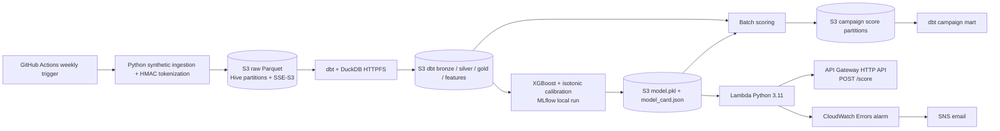

# Visa Card Adoption Propensity System

This repository is an end-to-end, low-cost POC for weekly Visa card-adoption propensity scoring. It uses S3 as the data lake, dbt-duckdb for transformations, GitHub Actions for orchestration, local MLflow for experiment tracking, and a Python 3.11 Lambda behind an API Gateway HTTP API.



## What is included

- Deterministic HMAC-SHA256 tokenization: no PAN is written to S3.
- 50,000 synthetic customers and 500,000 synthetic transactions across the prior 90 complete days by default.
- Bronze, silver, gold, latest-feature, and post-score mart dbt models with tests and external Parquet materializations.
- Temporal 60/30-day XGBoost training, isotonic calibration, PR-AUC/ROC-AUC/Precision@10%/Lift@10%/Brier evaluation, MLflow logging, and a model card.
- Campaign segments (`TARGET_PREMIUM`, `TARGET_STANDARD`, `NURTURE`, `EXCLUDE`) written to S3.
- Terraform for an encrypted versioned S3 bucket, restricted GitHub OIDC role, Lambda, HTTP API, CloudWatch error alarm, and SNS email subscription.

## Cost target

| Component | POC usage | Expected monthly cost |
| --- | --- | --- |
| S3 Standard / Glacier | Under the 5 GB free-tier target; older Parquet transitions at day 90 | $0–2 |
| GitHub Actions | One weekly run, typically well below 2,000 free minutes | $0 |
| ECR | Up to ten retained Lambda API images | $0–1 |
| Lambda + HTTP API | Low-volume POC, under free requests/compute allowances | $0 |
| CloudWatch + SNS | One basic alarm and occasional notification | $0–1 |
| **Total** | | **$0–5/month** |

AWS free-tier eligibility, region, outbound transfer, and GitHub plan determine the final bill. Set a billing alert before deploying.

## Prerequisites

- Python 3.11, Docker, Terraform >= 1.6, and AWS CLI.
- An AWS account where you may create S3, IAM, Lambda, API Gateway, CloudWatch, and SNS resources.
- A GitHub repository on its intended deployment branch. Terraform deliberately requires its exact `owner/repository` name to restrict OIDC trust.

## Deploy infrastructure

Authenticate the AWS CLI with a principal allowed to create the POC resources, then set the trust and alert inputs. The alert email receives an SNS confirmation message; accept it to activate notifications.

```bash
export TF_VAR_github_repository="YOUR_GITHUB_OWNER/YOUR_REPOSITORY"
export TF_VAR_alert_email="you@example.com"
terraform -chdir=terraform init
terraform -chdir=terraform apply
```

Terraform outputs the following values:

- `s3_bucket_name`: add as the GitHub repository secret `S3_BUCKET`.
- `github_actions_role_arn`: add as `AWS_ROLE_ARN`.
- `ecr_repository_url`: add as `ECR_REPOSITORY_URL`.
- `api_endpoint`: base endpoint used by `make test-api`.

Also configure `SLACK_WEBHOOK_URL` for notifications. `TOKEN_KEY` is optional for the POC; if omitted, the generator uses its documented static POC fallback. A real environment must set `TOKEN_KEY` through GitHub Secrets or another secret manager.

The GitHub Actions role has only `s3:ListBucket`, `s3:GetObject`, and `s3:PutObject` on this bucket; `lambda:UpdateFunctionCode` on this Lambda; and the minimum ECR upload actions for this API repository. It uses GitHub OIDC; no long-lived AWS access keys are configured.

## Run locally

After `terraform apply`, export the printed bucket name and AWS credential variables (for example via AWS SSO or an assumed role). dbt-duckdb's HTTPFS extension receives standard `AWS_ACCESS_KEY_ID`, `AWS_SECRET_ACCESS_KEY`, `AWS_SESSION_TOKEN` when present, and `AWS_REGION` from the environment.

```bash
export S3_BUCKET="$(terraform -chdir=terraform output -raw s3_bucket_name)"
export AWS_REGION="us-east-1"
make init
make run-pipeline
```

The complete local pipeline runs, in order: ingestion, dbt bronze-to-features build, training, scoring, then the post-score campaign mart build. Every writer uses an idempotent path based on `RUN_DATE`; rerun a historic date with `RUN_DATE=2026-08-04 make run-pipeline`.

### Review MLflow metrics locally

Training records parameters, evaluation metrics, the fitted model, and the model card in the supported SQLite MLflow store (`mlflow.db`) with artifacts in `mlartifacts/`. After a local training run, start the dashboard with:

```bash
mlflow ui --backend-store-uri sqlite:///mlflow.db --host 127.0.0.1 --port 5000
```

Open `http://127.0.0.1:5000`, then select the `visa_card_adoption` experiment. The GitHub Actions training job restores the latest tracked run and saves the updated database and artifacts in its MLflow cache.

Raw, dbt, and scoring outputs use `year=YYYY/month=MM/day=DD` Hive partitions. The canonical weekly score location is:

```text
s3://$S3_BUCKET/scores/weekly/year=YYYY/month=MM/day=DD/campaign_segments.parquet
```

This is the Hive-partitioned equivalent of a logical `scores/weekly/YYYY-MM-DD` weekly location and allows DuckDB and Athena-compatible readers to prune partitions.

`features_transactional` is intentionally a latest-day scoring snapshot. The training job reads the historical gold feature store instead because its required 60/30 temporal evaluation cannot be formed from a one-day snapshot.

## Deploy and test the API

Terraform builds and pushes the Python 3.11 Lambda image as part of its single apply, so Docker and AWS CLI authentication are required on the Terraform runner. Once training has published `model.pkl`, build and deploy an updated image to refresh warm Lambda containers:

```bash
make deploy-api
make test-api
```

`src/api/Dockerfile` is the deployment artifact. The weekly GitHub workflow pushes a versioned ECR image and updates Lambda after training, while the model itself remains in S3 and is cached in `/tmp` on each Lambda cold start.

Example request:

```bash
API_ENDPOINT="$(terraform -chdir=terraform output -raw api_endpoint)"
curl --request POST "$API_ENDPOINT/score" \
  --header 'content-type: application/json' \
  --data '{
    "recency_days": 5,
    "frequency_30d": 12,
    "monetary_30d": 1500.0,
    "digital_ratio_30d": 0.75,
    "cross_border_count_90d": 2,
    "age": 32,
    "tenure_months": 24
  }'
```

Example response:

```json
{
  "propensity_score": 0.8234,
  "score_decile": 9,
  "recommendation": "TARGET_PREMIUM",
  "expected_lift": "27.4x"
}
```

## Monitoring and operations

The workflow runs Sunday at 03:00 UTC and also supports `workflow_dispatch`. Pipeline failures stop dependent jobs and the final job posts status to Slack when `SLACK_WEBHOOK_URL` exists. Lambda `Errors > 0` over five minutes raises the `visa-propensity-lambda-errors` CloudWatch alarm and publishes to SNS.

CloudWatch alarm screenshot placeholder: capture the alarm in the AWS Console after the SNS subscription is confirmed and attach it to your operational runbook.

Useful commands:

```bash
make generate-data
make dbt-build
make train
make score
make deploy-infra
make deploy-api
make test-api
```

## Production migration path

- Swap DuckDB/dbt-duckdb for Glue, Athena, or a governed warehouse such as Redshift/Snowflake.
- Swap GitHub Actions scheduling for MWAA, EventBridge, or another managed orchestrator.
- Replace the synthetic generator with governed source connectors and schema contracts.
- Store the tokenization key in AWS Secrets Manager or an HSM-backed service and add rotation.
- Move MLflow tracking and model artifacts to a durable shared registry with approval gates.
- Add model monitoring, drift detection, fairness review, and human campaign approval workflows.
- Replace the zip-deployed Lambda with a versioned image, CI security scans, and canary aliases if serving volume grows.
